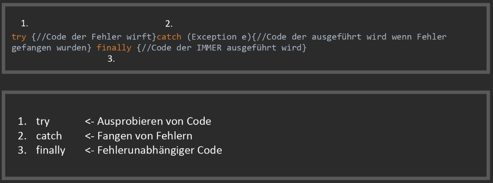

*[direkt zum Q&A](#-qa-fragen-und-antworten)*

## **A** Kniffel/Yazzy


- Schreibe Das Spiel Kniffel für die Konsole und zwei Spieler. 

Benötigte Ressourcen:

Scanner in einer While-Schleife um den User Input abzufangen:

```Java
import java.util.Scanner;

public class Main {
    public static void main(String[] args) {
        Scanner s = new Scanner(System.in);
            while (true){
                String str = s.nextLine();
                System.out.println(str); //Es wird ausgegeben was der Nutzer eingibt.
                if(str.equals("exit")){
                    break;
            }
        }
    }
}
```

Parsing (Umwandeln von Strings (Nutzereingabe) in ints): 

```Java
Integer.parseInt(str); //Wandelt einen String in einen int um, oder wirft einen Fehler.
```


Try-Catch:



- Die Würfel Klasse aus ## [**A0** Würfel](L01)  

Erfülle folgnde Anforderungen: 

- 2 Spieler können das Spiel Spielen
- Spieler können in der Konsole sehen wie viele Punkte sie Aktuell in welcher Rubrik haben
- Spieler können mit 5 Würfeln bis zu 3 mal würfeln
- Mit den Nummern 1-5 kann ein Spieler steuern welche Würfel er diese Runde behalten möchte
- Falsche eingaben werden mit Try/Cath abgefangen
- Die Zwischenergebnisse werden nach jeder Runde in der Konsole gezeichnet
- Nutzer erhalten hilfreiche Anweisungen

Beispiele:
```Java
//Beispiel ausgabe in der Konsole:

Spieler 1

1 | -
2 | 6
3 | -
4 | 16
5 | 10
6 | 24

Bonus | - 

drei Gleiche | -
vier Gleiche | 14
kleine Straße | 30
große Straße | 40
Full House | 25
Kniffel | -
Chance | -

------------

Spieler 2

1 | 4
2 | 6
3 | -
4 | -
5 | 10
6 | 6

Bonus | - 

drei Gleiche | -
vier Gleiche | 17
kleine Straße | 30
große Straße | 40
Full House | 25
Kniffel | 50
Chance | 21

```

---

## **?! _<small>Q&A</small>_** Fragen und Antworten

Fragen von: [Logophoman](https://github.com/Logophoman) eingepflegt.

#### Frage Eins
Antwort zu Frage Eins...

