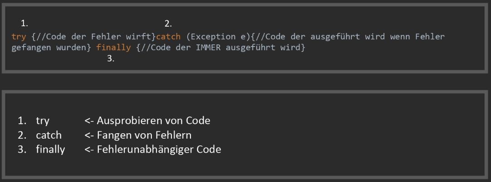

*[direkt zum Q&A](#-qa-fragen-und-antworten)*

## **A** Vier Gewinnt


- Schreibe Das Spiel 4 Gewinnt für die Konsole und zwei Spieler. 

Benötigte Ressourcen:

Scanner in einer While-Schleife um den User Input abzufangen:

```Java
import java.util.Scanner;

public class Main {
    public static void main(String[] args) {
        Scanner s = new Scanner(System.in);
            while (true){
                String str = s.nextLine();
                System.out.println(str); //Es wird ausgegeben was der Nutzer eingibt.
                if(str.equals("exit")){
                    break;
            }
        }
    }
}
```

Parsing (Umwandeln von Strings (Nutzereingabe) in ints): 

```Java
Integer.parseInt(str); //Wandelt einen String in einen int um, oder wirft einen Fehler.
```


Try-Catch:



Erfülle folgnde Anforderungen: 

- 2 Spieler können das Spiel Spielen
- Steine "fallen" nach unten, weden direkt unten angezeigt
- Spieler können in der Konsole die Reihen in denen ein Stein eingeworfen wird mit den Zahlen 1-10 ansteuern
- Falsche eingaben werden mit Try/Cath abgefangen
- Das Feld wird nach jeder Eingabe in der Konsole gezeichnet
- Nutzer erhalten hilfreiche Anweisungen

Beispiele:
```Java
//Leeres Feld:
 | | | | | | | | | | |
 | | | | | | | | | | |
 | | | | | | | | | | |
 | | | | | | | | | | |
 | | | | | | | | | | |
 | | | | | | | | | | |
 | | | | | | | | | | |
 | | | | | | | | | | |
 | | | | | | | | | | |
 | | | | | | | | | | |

//Feld im Spiel:

 | | | | | | | | | | |
 | | | | | | | | | | |
 | | | | | | | | | | |
 | | | | | | | | | | |
 | | | | | | | | | | |
 | | | | | | | | | | |
 | | | | | | | | | | |
 | | | |O| | | | | | |
 | | | |X| |X|O|X| | |
 | |X|O|X|O|O|O|X| | |
```

- Sind 4 Steine der gleichen "Sorte" in einer Reihe wird ausgegeben welcher Spieler gewinnt

---

## **?! _<small>Q&A</small>_** Fragen und Antworten

Fragen von: [Logophoman](https://github.com/Logophoman) eingepflegt.

#### Frage Eins
Antwort zu Frage Eins...

